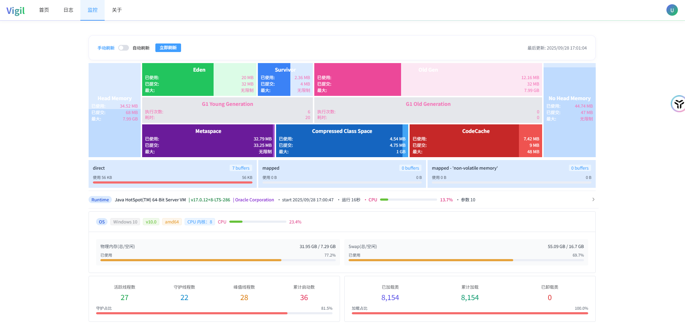
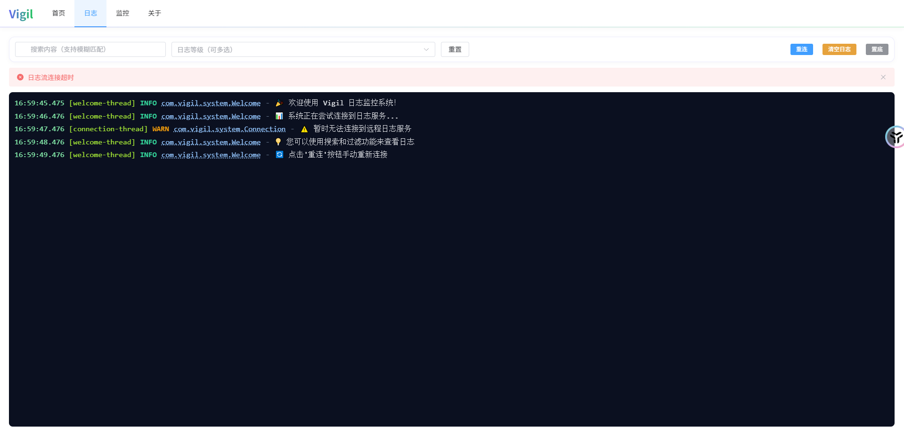

# Vigil

[](https://www.oracle.com/java/)
[](https://spring.io/projects/spring-boot)
[](LICENSE)

Vigil 是一个基于 Spring Boot 的 JVM 监控和实时日志流式传输工具，为 Java 应用程序提供全面的运行时监控和日志管理能力。

## ✨ 主要功能

### 🔍 JVM 运行时监控
- **内存监控**：堆内存、非堆内存使用情况
- **内存池详情**：Eden Space、Survivor Space、Old Generation、Metaspace、Code Cache 等
- **缓冲区池**：Direct Memory、Mapped Memory 使用统计
- **垃圾回收**：GC 执行次数、耗时统计
- **线程监控**：活跃线程数、守护线程数、峰值线程数、死锁检测
- **类加载**：已加载类数量、总加载数、卸载数
- **JIT 编译**：编译器信息、编译耗时
- **运行时信息**：JVM 版本、启动参数、运行时长
- **系统资源**：CPU 使用率、物理内存、Swap 空间

### 📊 实时日志流
- **SSE 支持**：基于 Server-Sent Events 的实时日志流
- **响应式架构**：使用 Reactor 实现非阻塞日志传输
- **包名过滤**：支持按包名过滤日志事件
- **异常处理**：完整的异常堆栈跟踪信息
- **JSON 格式**：标准化的日志事件数据结构

### 🚀 Spring Boot Starter
- **自动配置**：开箱即用的自动配置支持
- **零侵入**：无需修改现有代码，只需添加依赖
- **条件化加载**：支持通过配置控制功能启用/禁用


## 📦 快速开始

### 1. 添加依赖

在你的 `pom.xml` 中添加 Vigil 依赖：

```xml
<dependency>
    <groupId>io.github.tongxuehao</groupId>
    <artifactId>vigil</artifactId>
    <version>${latest}</version>
</dependency>
```

### 1.1 配置 Logback（推荐）

在 `logback-spring.xml`（或 `logback.xml`）中添加 Appender，并按需设置包名过滤：

```xml
<appender name="vigil" class="org.htx.vigil.logging.appender.LogbackAppender">
    <!-- 项目的包名配置，进行堆栈日志过滤 -->
    <packageName>com.example.demo</packageName>
</appender>

<!-- 将 appender 绑定到 ROOT 或指定 logger -->
<root level="INFO">
    <appender-ref ref="vigil"/>
    <!-- 其他 appender ... -->
  </root>
```

### 2. 启动应用

Vigil 会自动配置，无需额外配置即可使用。

### 3. Web 界面

访问 `/vigil/index.html` 路径查看内置的监控界面。

## 🖼️ 截图

监控总览：



实时日志：



## 🤝 贡献指南

1. Fork 本仓库
2. 创建特性分支 (`git checkout -b feature/AmazingFeature`)
3. 提交更改 (`git commit -m 'Add some AmazingFeature'`)
4. 推送到分支 (`git push origin feature/AmazingFeature`)
5. 打开 Pull Request

## 🙏 致谢

- [Spring Boot](https://spring.io/projects/spring-boot) - 应用框架
- [Reactor](https://projectreactor.io/) - 响应式编程
- [Logback](https://logback.qos.ch/) - 日志框架

---

⭐ 如果这个项目对你有帮助，请给它一个星标！

## 📎 仓库地址

- 前端（监控 UI）：[vigil-ui](https://github.com/TongXueHao/vigil-ui)
- 后端/Starter：[vigil](https://github.com/TongXueHao/vigil)
